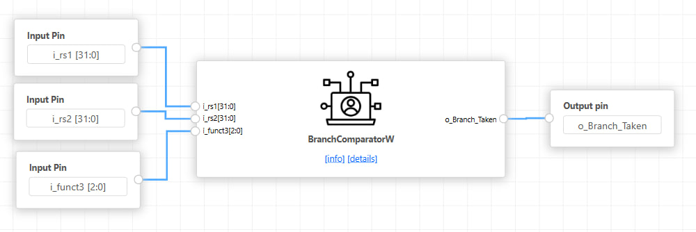

# RISC-V Branch Comparator

A 32-bit hardware branch comparator module designed for a RISC-V processor architecture. The module evaluates standard RISC-V branching instructions (BEQ, BNE, BLT, BGE, BLTU, BGEU) and outputs a taken/not-taken signal. 

Generated and synthesized using the ChipInventor Cloud EDA Tool and OpenLane flow.

## Architecture & Simulation
The module takes two 32-bit operands (`i_rs1`, `i_rs2`) and a 3-bit control signal (`i_funct3`) to evaluate the branch condition.

## ASIC Implementation Details
The design was taken through the OpenLane RTL-to-GDSII flow targeting the **Sky130 (sky130_fd_sc_hd)** standard cell library. The run completed successfully with zero DRC, LVS, or antenna violations.

*   **Core Area:** 6277.27 µm²
*   **Max Target Clock Frequency:** ~91.91 MHz (10.88 ns period)
*   **Total Cell Count:** 878 (177 pre-synthesis)
*   **Total Wire Length:** 15,307 µm
*   **Routing Layers Used:** Layer 2 (42%), Layer 3 (49%), Layer 4 (18%), Layer 5 (19%)

## Physical Layout (GDSII)
Below are the layout views of the routed design:

## Repository Structure
*   `src/`: Contains your Verilog source files (`branchcomparator.v`).
*   `images/`: Contains the block diagram, simulation waveforms, and 2D/3D layout views.
